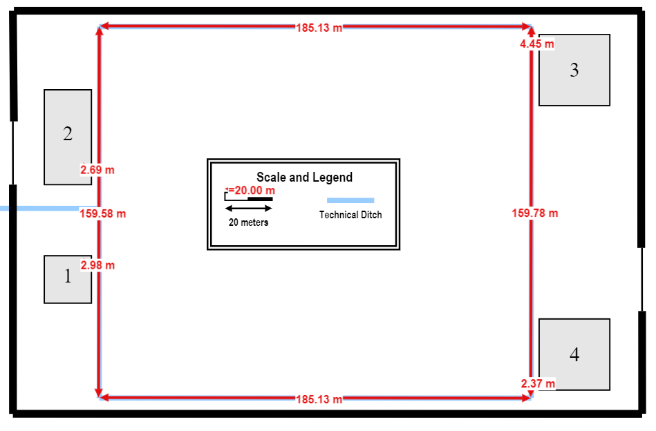

# Campus Final Inventory #

-----------------------------------------------------------------------------------------------------

* The Campus consists in four distinct buildings. 
* The campus backbone (the starting point of all cables in the subsystem 3 is located in the Building 1 (where the Campus Distributor is located).
* Since the Campus Distributor is located in the building 1, there must be a connection via optic fiber cable between this and the other buildings on the campus.
* Prioritizing network security, we decided to connect the remaining campus´s buildings to the Building 1 using two different cables along different routes, preventing the network from being compromised if one of the routes is destroyed.

|             Equipment              | Quantity |
|:----------------------------------:|:--------:|
|           Access Points            |    14    |
|         Optic Fiber Cable          | 2138,36  |
|          CA7 Copper Cable          | 23754.10 |
|              Outlets               |   618    |
|  Telecommunication Enclosure 12U   |    1     |
|  Telecommunication Enclosure 24U   |    5     |
|  Telecommunication Enclosure 36U   |    2     |
|     Copper Patch Cords (0.5 m)     |   816    |
|      Copper Patch Cords (5 m)      |   618    |
| Copper Patch Panel 2U (48 entries) |    16    |
| Copper Patch Panel 1U (24 entries) |    2     |
|     Fiber Patch Cords (0.5 m)      |   120    |
| Fiber Patch Panel 3U (72 entries)  |    1     |
| Fiber Patch Panel 1U (24 entries)  |    7     |
