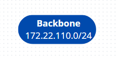

# Building 1

## Specifications

-----------------------------------------------------------------------------------------------------------------------------------------------------------------------------------------

- The team member assigned with building 1 must put together into a single Packet Tracer Simulation all the simulations created by each team member.
- IPv4 networks:
  
  - End user outlets on the ground floor: 50 nodes
  - End user outlets on floor one: 50 nodes
  - Wi-Fi network: 80 nodes 
  - DMZ (Servers, administration workstations, and network infrastructure devices): 100 nodes 
  - VoIP (IP-phones): 67 nodes
  - Backbone: 200 nodes

## VLAN database and IPv4 network

-----------------------------------------------------------------------------------------------------------------------------------------------------------------------------------------

### Backbone

|       VLAN_name       | VLAN_ID | Total_Nodes | Space_size | Prefix | Number_Of_Hosts |   Network_IP    | First_Valid_IP | Last_Valid_IP  |   Broadcast    |  Subnet mask  |
|:---------------------:|:-------:|:-----------:|:----------:|:------:|:---------------:|:---------------:|:--------------:|:--------------:|:--------------:|:-------------:|
|     **BackBone**      |   367   |     200     |    256     |   24   |       254       | 172.22.110.0/24 |  172.22.110.1  | 172.22.110.254 | 172.22.110.255 | 255.255.255.0 |

### Building 1

|       VLAN_name       | Total_Nodes | Space_size | Prefix | Number_Of_Hosts |    Network_IP     | First_Valid_IP | Last_Valid_IP  |   Broadcast    |   Subnet mask   |
|:---------------------:|:-----------:|:----------:|:------:|:---------------:|:-----------------:|:--------------:|:--------------:|:--------------:|:---------------:|
|     **VLAN-Dmz1**     |     100     |    128     |   25   |       126       |  172.22.108.0/25  |  172.22.108.1  | 172.22.108.126 | 172.22.108.127 | 255.255.255.128 |
|    **VLAN-Wifi1**     |     80      |    128     |   25   |       126       | 172.22.108.128/25 | 172.22.108.129 | 172.22.108.254 | 172.22.108.255 | 255.255.255.128 |
|    **VLAN-VoIP1**     |     67      |    128     |   25   |       126       |  172.22.109.0/25  |  172.22.109.1  | 172.22.109.126 | 172.22.109.127 | 255.255.255.128 |
| **VLAN-GroundFloor1** |     50      |     64     |   26   |       62        | 172.22.109.128/26 | 172.22.109.129 | 172.22.109.190 | 172.22.109.191 | 255.255.255.192 |
|  **VLAN-FloorOne1**   |     50      |     64     |   26   |       62        | 172.22.109.192/26 | 172.22.109.193 | 172.22.109.254 | 172.22.109.255 | 255.255.255.192 |
|       **Total**       |     347     |    512     |   23   |       510       | ----------------  | -------------- | -------------- | -------------- | --------------- |

### Relevant justification

- The backbone IP tree only has only one block represented because it´s the minimum necessary.
- The networks were organized in descending order of nodes, thus filling as many addresses as possible without them being wasted.
- Although the distribution of IPv4 network addresses is adequate, there are still IPs that can be assigned to new nodes that may be introduced in the future.

## Packet Tracer Simulation

-----------------------------------------------------------------------------------------------------------------------------------------------------------------------------------------

### Building 1

### Campus Backbone

### Relevant justification

- The approach adopted is in accordance with what was established in Sprint1.
- As requested, the simulation allows communication between the different VLANs and communication with the ISP. Each router forwards any unknown address to the router present in the CD and this forwards it to each building or to the ISP through a DSL modem.
- All switches were configured to have the number of ports necessary to establish the connections specified in the statement (FFE ports for fiber optic cables and CFE ports for copper cables). 
- All connections between switches were changed to trunk mode, the VTP domain changed to the given domain (r2324ddg2) and the CD switch configured in server mode, the rest were configured in client mode, allowing all switches in all buildings to have all configured VLANs in their VLAN database. 
- For unknown reasons, the connection between access points and laptops is not represented in the Cisco Packet Tracer image when we open the document, so the following process must be followed for every access point represented:

    1. Open the Access Point;
    2. Go to the config page;
    3. Interface -> Port1;
    4. In the "2.4 GHz Channel" change from 6 to another value and then back to 6;
    5. The exit the Access Point interface and the connection between the Access Point and the Laptop will appear.

## Network Configuration

--------------------------------------------------------------------------------------------------------------------------------------------------------------------------------------

### Backbone

- The campus backbone is represented in the simulation by means of the CD switch (corresponding to the campus distributor), by the various BD (Building Distributors) switches of all campus buildings and by the router of building 1, since it is responsible for communication between the various buildings on campus.
- As in the 1st Sprint, data transmission to the buildings was carried out through an inter-cross connects connection, represented by the B1 BD switch, by the horizontal connects, represented by the B1 FD1 and B1 FD0 switches, and from these to the end devices. 
- It should be noted that the CD-BD, BD-FD connections were made using fiber optic cable, requiring the use of FFE adapters in the switches and in the B1 Router, which is connected to B1 BD. The connection between the end devices and the CPs and HCs was made using copper cable.

### Internet connection

- The representation of the Internet connection is made through a Cloud, an ISP router and a Modem. It has only 2 valid addresses (in addition to those reserved for network identification and broadcasting), the first being associated with the ISP router, and the second associated with the CD router.

### Specifications

- The implementation of the proposed requirements for Building 1 starts from the switch with host name B1 BD, which establishes a connection with two other switches representing floors 0 and 1 (B1 FD0 and B1 FD1, respectively).
- All ports that are not connected to end devices are configured in trunk mode, being the port type indicated for establishing connections with multiple VLANs. On the other hand, ports that connect to end devices are configured in access mode since they only connect to a single VLAN.
- In the configurations of the two Floor Distributors in the building, the following VLANs were associated with the end devices:

|        **VLAN_Name**         | **VLAN_ID** |     **Device(s)**     |
|:----------------------------:|:-----------:|:---------------------:|
|       VLAN-GroundFloor       |     362     |        B1 PC0         |
|        VLAN-FloorOne         |     363     |        B1 PC1         |
|          VLAN-Wifi           |     364     | B1 AP0.1 and B1 AP1.1 |
|           VLAN-Dmz           |     365     |        B1 DMZ         |
|          VLAN-VoIP           |     366     | B1 VoIP0 and B1 VoIP1 |

- Since the main objective of the sprint is to present a logical implementation plan for the network and for reasons of interpretation, it was decided not to present the total number of nodes indicated in the statement. Thus, each two final devices (one on each floor and one laptop per Access Point represented) presented in the simulation represents the totality of devices that would be needed:

|         **Device(s)**         | **Total nodes** |
|:-----------------------------:|:----------------|
|            B1 PC0             | 50              |
|            B1 PC1             | 50              |
| B1 Laptop0.1 and B1 Laptop1.1 | 80              |
|            B1 DMZ             | 100             |
|     B1 VoIP0 and B1 VoIP1     | 67              |

### Pings

- To confirm that everything works correctly, several images are displayed that show the success of ping tests between end devices in the same building and between different buildings, including the ISP.

#### Between B1 PC0 and the Building 1

#### Between B1 PC1 and the Building 1

#### Between B1 Laptop0.1 and the Building 1

#### Between B1 Laptop1.1 and the Building 1

!

#### Between B1 DMZ and the Building 1

#### Between B1 Router and the Building 1

#### Between B1 PC0 and the other buildings, including the ISP

#### Between B1 PC1 and the other buildings, including the ISP

#### Between B1 Laptop1.1 and the other buildings, including the ISP

#### Between B1 Laptop0.1 and the other buildings, including the ISP

#### Between B1 DMZ and the other buildings, including the ISP

#### Between B1 Router and the other buildings, including the ISP

### Switches and Routers configuration files

- The configuration files for all switches and routers necessary for the correct functioning of the Building 1 structured cabling project can be found at this link: [Config_Files](..%2FConfig_Files)

### Routing Tables

#### Building 1 CD - B1 Router (172.22.110.1/24)

| **Building** |   **Network**   |   **Mask**    | **Next Hop** |
|:------------:|:---------------:|:-------------:|:------------:|
|      2       | 172.22.96.0/22  | 255.255.252.0 | 172.22.110.2 |
|      3       | 172.22.100.0/22 | 255.255.252.0 | 172.22.110.3 |
|      4       | 172.22.104.0/22 | 255.255.252.0 | 172.22.110.4 |
|   Internet   |    0.0.0.0/0    |    0.0.0.0    |  5.60.37.66  |

#### ISP - R ISP(5.60.37.66)

|   **Network**   |   **Mask**    | **Next Hop**  |
|:---------------:|:-------------:|:-------------:|
| 172.22.96.0/22  | 255.255.252.0 |  5.60.37.67   |
| 172.22.100.0/22 | 255.255.252.0 |  5.60.37.67   |
| 172.22.104.0/22 | 255.255.252.0 |  5.60.37.67   |
| 172.22.108.0/23 | 255.255.254.0 |  5.60.37.67   |
|    0.0.0.0/0    |    0.0.0.0    |  5.60.37.67   |

