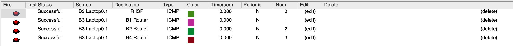

# Building 3

## Specifications

- IPv4 networks:

  - End user outlets on the ground floor: 110 nodes
  - End user outlets on floor one: 130 nodes
  - Wi-Fi network: 200 nodes
  - DMZ (Servers, administration workstations, and network infrastructure devices): 45 nodes
  - VoIP (IP-phones): 180 nodes

## VLAN database and IPv4 network

|       VLAN_name       | VLAN_ID | Total_Nodes | Space_size | Prefix | Number_Of_Valid_Networks |    Network_IP     | First_Valid_IP | Last_Valid_IP  |   Broadcast    |   Subnet mask   |
|:---------------------:|:-------:|:-----------:|:----------:|:------:|:------------------------:|:-----------------:|:--------------:|:--------------:|:--------------:|:---------------:|
|    **VLAN-Wi-Fi3**    |   375   |     200     |    256     |   24   |           254            |  172.22.100.0/24  |  172.22.100.1  | 172.22.100.254 | 172.22.100.255 |  255.255.255.0  |
|    **VLAN-VoIP3**     |   377   |     180     |    256     |   24   |           254            |  172.22.101.0/24  |  172.22.101.1  | 172.22.101.254 | 172.22.101.255 |  255.255.255.0  |
|  **VLAN-FloorOne3**   |   374   |     130     |    256     |   24   |           254            |  172.22.102.0/24  |  172.22.102.1  | 172.22.102.254 | 172.22.102.255 |  255.255.255.0  |
| **VLAN-GroundFloor3** |   373   |     110     |    128     |   25   |           126            |  172.22.103.0/25  |  172.22.103.1  | 172.22.103.126 | 172.22.103.127 | 255.255.255.128 |
|     **VLAN-DMZ3**     |   376   |     45      |     64     |   26   |            62            | 172.22.103.128/26 | 172.22.103.129 | 172.22.103.190 | 172.22.103.191 | 255.255.255.192 |

### Relevant justification

- The networks were organized in descending order of nodes, thus filling as many addresses as possible without them being wasted.
- Although the distribution of IPv4 network addresses is adequate, there are still IPs that can be assigned to new nodes that may be introduced in the future.

## Packet Tracer Simulation

### Building 3

### Relevant justification

- The approach adopted is in accordance with what was established in Sprint1.
- All switches were configured to have the number of ports necessary to establish the connections specified in the statement (FFE ports for fiber optic cables and CFE ports for copper cables).
- All connections between switches were changed to trunk mode, the VTP domain changed to the given domain (r2324ddg2) and the CD switch configured in server mode, the rest were configured in client mode, allowing all switches in all buildings to have all configured VLANs in their VLAN database.

## Network Configuration

--------------------------------------------------------------------------------------------------------------------------------------------------------------------------------------

### Specifications

- The implementation of the proposed requirements for Building 3 starts from the switch with host name B3 BD, which establishes a connection with two other switches representing floors 0 and 1 (B3 FD0 and B3 FD1, respectively).
- All ports that are not connected to end devices are configured in trunk mode, being the port type indicated for establishing connections with multiple VLANs. On the other hand, ports that connect to end devices are configured in access mode since they only connect to a single VLAN.
- In the configurations of the two Floor Distributors in the building, the following VLANs were associated with the end devices:

|        **VLAN_Name**         | **VLAN_ID** |                       **Device(s)**                       |
|:----------------------------:|:-----------:|:---------------------------------------------------------:|
|       VLAN-GroundFloor       |     373     |                          B3 PC0                           |
|        VLAN-FloorOne         |     374     |                          B3 PC1                           |
|          VLAN-Wifi           |     375     | B3 LAPTOP0.1, B3 LAPTOP0.2, B3 LAPTOP1.1 and B3 LAPTOP1.2 |
|           VLAN-Dmz           |     376     |                          B3 DMZ                           |
|          VLAN-VoIP           |     377     |                   B3 VoIP0 and B3 VoIP1                   |

- Since the main objective of the sprint is to present a logical implementation plan for the network and for reasons of interpretation, it was decided not to present the total number of nodes indicated in the statement. Thus, each two final devices (one on each floor and one laptop per Access Point represented) presented in the simulation represents the totality of devices that would be needed:

|                       **Device(s)**                       | **Total nodes** |
|:---------------------------------------------------------:|:----------------|
|                          B3 PC0                           | 110             |
|                          B3 PC1                           | 130             |
| B3 LAPTOP0.1, B3 LAPTOP0.2, B3 LAPTOP1.1 and B3 LAPTOP1.2 | 200             |
|                          B3 DMZ                           | 45              |
|                   B3 VoIP0 and B3 VoIP1                   | 180             |

### Pings

- To confirm that everything works correctly, several images are displayed that show the success of ping tests between end devices in the same building and between different buildings, including the ISP.

#### Between B3 PC0 and the Building 3

#### Between B3 PC1 and the Building 3

#### Between B3 Laptop0.1 and the Building 3

#### Between B3 Laptop0.2 and the Building 3

#### Between B1 Laptop1.1 and the Building 3

#### Between B3 Laptop1.2 and the Building 3

#### Between B3 Server and the Building 3

#### Between B3 Router and the Building 3

#### Between B3 PC0 and the other buildings, including the ISP

#### Between B3 PC1 and the other buildings, including the ISP

#### Between B3 Laptop0.1 and the other buildings, including the ISP

#### Between B3 Laptop0.2 and the other buildings, including the ISP

#### Between B3 Laptop1.1 and the other buildings, including the ISP

#### Between B3 Laptop1.2 and the other buildings, including the ISP

#### Between B3 DMZ and the other buildings, including the ISP

#### Between B3 Router and the other buildings, including the ISP

### Switches and Routers configuration files

- The configuration files for all switches and routers necessary for the correct functioning of the Building 3 structured cabling project can be found at this link: [Config_Files](..%2FConfig_Files)

#### Routing Tables

##### Building 3 - B3 Router (172.22.110.3/24)

| **Building** |   **Network**   |   **Mask**    | **Next Hop** |
|:------------:|:---------------:|:-------------:|:------------:|
|      1       | 172.22.108.0/23 | 255.255.254.0 | 172.22.110.1 |
|      2       | 172.22.96.0/22  | 255.255.252.0 | 172.22.110.2 |
|      4       | 172.22.104.0/22 | 255.255.252.0 | 172.22.110.4 |
|   Default    |    0.0.0.0/0    |    0.0.0.0    | 172.22.110.1 |
