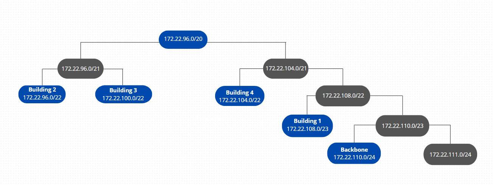

# Sprint 2 - Planning #

###  Sprint Master: 1220917 ###

## 1. Sprint backlog and task's assignment ##
| Task ID | Task                                                                                                                                                                                                 | Task's assignment |
|:-------:|------------------------------------------------------------------------------------------------------------------------------------------------------------------------------------------------------|:-----------------:|
|  T.2.1  | Development of a layer two and layer three Packet Tracer simulation for building 1, encompassing the campus backbone.Integration of every member’s Packet Tracer simulation intoa single simulation. |      1220812      |
|  T.2.2  | Development of a layer two and layer three Packet Tracersimulation for building 2, encompassing the campus backbone.                                                                                 |      1220772      |
|  T.2.3  | Development of a layer two and layer three Packet Tracer simulation for building 3, encompassing the campus backbone.                                                                                |      1221194      |
|  T.2.4  | Development of a layer two and layer three Packet Tracer simulation for building 4, encompassing the campus backbone.                                                                                |      1220917      |

## 2. Specifications ##
* The team use the Packet Tracer version 8.2.1.0118 .
* A VLAN for all end-user outlets at the ground floor.
* A VLAN for all end-user outlets at floor one.
* A VLAN for the Wi-Fi network (for all access-points’ outlets within the building). 
* A VLAN for the building DMZ (for servers, administration workstations, and infrastructure
  network devices).
* A VLAN for VoIP (for all IP-phones within the building).* All the other ethernet network cables will be of category 7 (CAT7), since the performance is overall better than CAT6 and lower.
* The IPv4 network address assigned to the backbone network.
* The IPv4 node address each router will use in the backbone network connection. 
* All connections between *switches* were changed to trunk mode, *VTP* domain changed to the given domain (r2324ddg2)
  and the *switch* MC configured in server mode, the rest were configured in client mode, allowing all
  *switches* in all buildings have all *VLANs* configured in their *VLAN* database.

### 2.1 Conventions

* The name of the complete file should be campus.pkt;
* There should be a file for each building;
* Each building file should be named "buildingX.pkt", where X means the number of the building;

#### 2.2 Devices naming

* **Routers:** B[Building Number] Router (Example: B1 Router)
* **Switches:** B[Building Number] [Cross Connect Type][Floor Number] (Example: B1 FD1)
* **PC:** B[Building Number] PC[Floor Number] (Example: B1 PC1)
* **Laptops:** B[Building Number] Laptop[Floor Number].[Laptop Number] (Example: B1 Laptop0.1)
* **Wireless Access Points:** B[Building Number] AP[Floor Number].[Laptop Number] (Example: B1 AP0.1)
* **IP-phones:** B[Building Number] VOIP[Floor Number] (Example: B1 VOIP1)
* **Server:** B[Building Number] DMZ[Floor Number] (Example: B1 DMZ1)

## 3. VLAN's ID Table ##

| **Building** | **VLAN-GroundFloor** | **VLAN-FloorOne** | **VLAN-Wifi** | **VLAN-Dmz** | **VLAN-VoIP** | **BackBone** |
|:------------:|:--------------------:|:-----------------:|:-------------:|:------------:|:-------------:|:------------:|
|  Building 1  |         362          |        363        |      364      |     365      |      366      |     367      |
|  Building 2  |         368          |        369        |      370      |     371      |      372      |     367      |
|  Building 3  |         373          |        374        |      375      |     376      |      377      |     367      |
|  Building 4  |         378          |        379        |      380      |     381      |      382      |     367      |

## 4. IPv4 network address Tables ##

### Backbone ###

|       VLAN_name       | Total_Nodes | Space_size | Prefix | Number_Of_Hosts |   Network_IP    | First_Valid_IP | Last_Valid_IP  |   Broadcast    |  Subnet mask  |
|:---------------------:|:-----------:|:----------:|:------:|:---------------:|:---------------:|:--------------:|:--------------:|:--------------:|:-------------:|
|     **BackBone**      |     200     |    256     |   24   |       254       | 172.22.110.0/24 |  172.22.110.1  | 172.22.110.254 | 172.22.110.255 | 255.255.255.0 |

### Building 1  ###

|       VLAN_name       | Total_Nodes | Space_size | Prefix | Number_Of_Hosts |    Network_IP     | First_Valid_IP | Last_Valid_IP  |   Broadcast    |   Subnet mask   |
|:---------------------:|:-----------:|:----------:|:------:|:---------------:|:-----------------:|:--------------:|:--------------:|:--------------:|:---------------:|
|     **VLAN-Dmz1**     |     100     |    128     |   25   |       126       |  172.22.108.0/25  |  172.22.108.1  | 172.22.108.126 | 172.22.108.127 | 255.255.255.128 |
|    **VLAN-Wifi1**     |     80      |    128     |   25   |       126       | 172.22.108.128/25 | 172.22.108.129 | 172.22.108.254 | 172.22.108.255 | 255.255.255.128 |
|    **VLAN-VoIP1**     |     67      |    128     |   25   |       126       |  172.22.109.0/25  |  172.22.109.1  | 172.22.109.126 | 172.22.109.127 | 255.255.255.128 |
| **VLAN-GroundFloor1** |     50      |     64     |   26   |       62        | 172.22.109.128/26 | 172.22.109.129 | 172.22.109.190 | 172.22.109.191 | 255.255.255.192 |
|  **VLAN-FloorOne1**   |     50      |     64     |   26   |       62        | 172.22.109.192/26 | 172.22.109.193 | 172.22.109.254 | 172.22.109.255 | 255.255.255.192 |
|       **Total**       |     347     |    512     |   23   |       510       | ----------------  | -------------- | -------------- | -------------- | --------------- |

### Building 2  ###

|       VLAN_name       | Total_Nodes | Space_size | Prefix | Number_Of_Hosts |    Network_IP    | First_Valid_IP | Last_Valid_IP |   Broadcast   |   Subnet mask   |
|:---------------------:|:-----------:|:----------:|:------:|:---------------:|:----------------:|:--------------:|:-------------:|:-------------:|:---------------:|
|    **VLAN-Wifi2**     |     220     |    256     |   24   |       254       |  172.22.96.0/24  |  172.22.96.1   | 172.22.96.254 | 172.22.96.255 |  255.255.255.0  |
|  **VLAN-FloorOne2**   |     120     |    128     |   25   |       126       |  172.22.97.0/25  |  172.22.97.1   | 172.22.97.126 | 172.22.97.127 | 255.255.255.128 |
|    **VLAN-VoIP2**     |     110     |    128     |   25   |       126       | 172.22.97.128/25 | 172.22.97.129  | 172.22.97.254 | 172.22.97.255 | 255.255.255.128 |
| **VLAN-GroundFloor2** |     90      |    128     |   25   |       126       |  172.22.98.0/25  |  172.22.98.1   | 172.22.98.126 | 172.22.98.127 | 255.255.255.128 |
|     **VLAN-Dmz2**     |     50      |     64     |   26   |       62        | 172.22.98.128/26 | 172.22.98.129  | 172.22.98.190 | 172.22.98.191 | 255.255.255.192 |
|       **Total**       |     590     |    1024    |   22   |      1022       | ---------------- | -------------- | ------------- | ------------- | --------------- |

### Building 3  ###

|       VLAN_name       | Total_Nodes | Space_size | Prefix | Number_Of_Hosts |    Network_IP     | First_Valid_IP | Last_Valid_IP  |   Broadcast    |   Subnet mask   |
|:---------------------:|:-----------:|:----------:|:------:|:---------------:|:-----------------:|:--------------:|:--------------:|:--------------:|:---------------:|
|    **VLAN-Wifi3**     |     200     |    256     |   24   |       254       |  172.22.100.0/24  |  172.22.100.1  | 172.22.100.254 | 172.22.100.255 |  255.255.255.0  |
|    **VLAN-VoIP3**     |     180     |    256     |   24   |       254       |  172.22.101.0/24  |  172.22.101.1  | 172.22.101.254 | 172.22.101.255 |  255.255.255.0  |
|  **VLAN-FloorOne3**   |     130     |    256     |   24   |       254       |  172.22.102.0/24  |  172.22.102.1  | 172.22.102.254 | 172.22.102.255 |  255.255.255.0  |
| **VLAN-GroundFloor3** |     110     |    128     |   25   |       126       |  172.22.103.0/25  |  172.22.103.1  | 172.22.103.126 | 172.22.103.127 | 255.255.255.128 |
|     **VLAN-Dmz3**     |     45      |     64     |   26   |       62        | 172.22.103.128/26 | 172.22.103.129 | 172.22.103.190 | 172.22.103.191 | 255.255.255.192 |
|       **Total**       |     665     |    1024    |   22   |      1022       | ----------------- | -------------- | -------------  | -------------- | --------------- |

### Building 4  ###

|       VLAN_name       | Total_Nodes | Space_size | Prefix | Number_Of_Hosts |    Network_IP     | First_Valid_IP | Last_Valid_IP  |   Broadcast    |   Subnet mask   |
|:---------------------:|:-----------:|:----------:|:------:|:---------------:|:-----------------:|:--------------:|:--------------:|:--------------:|:---------------:|
|    **VLAN-Wifi4**     |     190     |    256     |   24   |       254       |  172.22.104.0/24  |  172.22.104.1  | 172.22.104.254 | 172.22.104.255 |  255.255.255.0  |
|    **VLAN-VoIP4**     |     170     |    256     |   24   |       254       |  172.22.105.0/24  |  172.22.105.1  | 172.22.105.254 | 172.22.105.255 |  255.255.255.0  |
|  **VLAN-FloorOne4**   |     150     |    256     |   24   |       254       |  172.22.106.0/24  |  172.22.106.1  | 172.22.106.254 | 172.22.106.255 |  255.255.255.0  |
| **VLAN-GroundFloor4** |     120     |    128     |   25   |       126       |  172.22.107.0/25  |  172.22.107.1  | 172.22.107.126 | 172.22.107.127 | 255.255.255.128 |
|     **VLAN-Dmz4**     |     40      |     64     |   26   |       62        | 172.22.107.128/26 | 172.22.107.129 | 172.22.107.190 | 172.22.107.191 | 255.255.255.192 |
|       **Total**       |     670     |    1024    |   22   |      1022       | ----------------- | -------------- | -------------- | -------------- | --------------- |

### ###