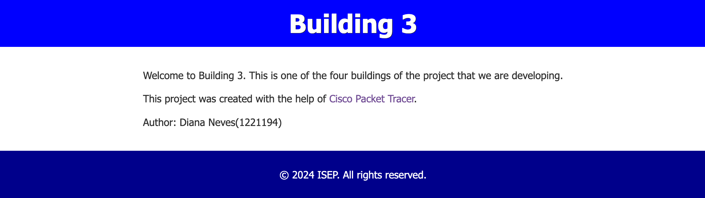
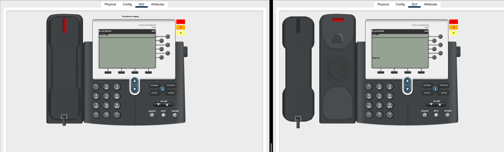
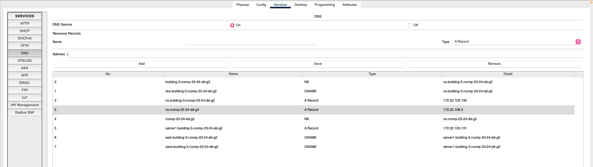

# Building 1

## Specifications

-----------------------------------------------------------------------------------------------------------------------------------------------------------------------------------------

- At this sprint each team member should use as a starting point the overall simulation resulting from sprint 2 (campus.pkt), nevertheless, each team member will oversee the same building as before.
- Each team member must:

      - change from static routing to OSPF based dynamic routing in every existing router.

      - add a new server to the local DMZ network and create a simple HTML page, in each building.

      - the router in each building must provide the SHCPv4 service to all IPv4 networks within a building, with the exception of DMZ networks and the backbone.

      - in the VoIP VLAN, the DHCP server configuration must include option 150.

      - in the simulation, for VoIP local testing, in each building there should be at least two connected IP phones (of 7960 model). Ports of switches connecting to Cisco IP phones 7960, must have the voice
      VLAN enabled (switchport voice vlan VLANID) and the access VLAN disabled (no switchport access vlan).

      - one DNS domain is going to be established on each building.

-  Knowing a name server that is out of the scope of
   the local domain requires in fact two DNS records:

        - The NS record itself: the record’s name is the domain’s name, and the record’s data is the DNS
        name of the name server of that domain.

        - The A record for the NS record: the record’s name is the DNS name of the name server and
        the record’s data is the IPv4 address the name server.

  - All HTTP servers are to be named as server1. Within each DNS domain there should be:

        - a www alias (CNAME) mapped to the same domain’s server1 A record.
  
        - an alias, named web also mapped to the domain’s server1 A record.
  
        - one additional alias (CNAME), with name dns, and mapped to the domain’s ns A record, should also
        exist.

- All end-nodes within a building should be using the local DNS name server, and, if supported, have the
  default DNS domain name set to the local DNS domain name.

      - For end-nodes with automatic DHCP configuration, that information should be inserted into the local
      DHCP pools.

      - For end-nodes with static manual configuration, such as servers, that information must be added manually.

- HTTP and HTTPS requests received in the router’s backbone interface must be redirected to the DNS server
  in the local DMZ. Both HTTP and HTTPS use TCP connections, the default service ports numbers must be 80 and 443.

- The HTTP/HTTPS service on the DNS server must be enabled and must be created a simple HTML page identifying it.

- Traffic access policies (which packets are allowed or not) must be implemented in routers. They will be particularly restrictive on traffic exchanged with the
  local DMZ, and traffic that is intended to the router itself.

- Output:

      - Packet Tracer simulation file for the corresponding building, it should be named building1.pkt

      - document detailing DNS databases records on the building’s DNS name server, it may be a screenshot of the server’s DNS database.

      - a text file with a configuration dump for every switch and for every router within the encompassed building.

## OSPF dynamic routing

-----------------------------------------------------------------------------------------------------------------------------------------------------------------------------------------

### Building 3 router configuration:

    router ospf 3
    network 172.22.103.0 0.0.0.127 area 3
    network 172.22.110.0 0.0.0.255 area 0
    default-information originate

* The "default-information originate" command is used in the OSPF routing protocol to insert the default route to point to the ISP router.

## HTTP servers

------------------------------------------------

- Another server was added to the DMZ VLAN to take over the HTTP service.
- In the services of this server, the HTTP service was enabled and a simple HTML page was added identifying the building.

----------------------------------------

## DHCPv4 service

----------------------------------

- Each building's router provides DHCPv4 service to all local networks (within the building), except for DMZ and backbone networks, where IPv4 addresses are static and manually defined.
- For the VoIP VLAN, the DHCP server configuration includes option 150, which represents the IP address of the TFTP (Trivial File Transfer Protocol) server to be used by the phones.
- All computers and laptops now receive network configuration via DHCP.

### Floor 0

     ip dhcp pool VLAN-GroundFloor3
        network 172.22.103.0 255.255.255.128
        default-router 172.22.103.1
        dns-server 172.22.103.130
        domain-name Building-3.rcomp-23-24-dd-g2

### Floor 1

    ip dhcp pool VLAN-FloorOne3
      network 172.22.102.0 255.255.255.0
      default-router 172.22.102.1
      dns-server 172.22.103.130
      domain-name Building-3.rcomp-23-24-dd-g2

### Wi-fi

    ip dhcp pool VLAN-Wi-Fi3
      network 172.22.100.0 255.255.255.0
      default-router 172.22.100.1
      dns-server 172.22.103.130
      domain-name Building-3.rcomp-23-24-dd-g2

### VoIP

    ip dhcp pool VLAN-VoIP3
      network 172.22.101.0 255.255.255.0
      default-router 172.22.101.1
      option 150 ip 172.22.101.1
      dns-server 172.22.103.130
      domain-name Building-3.rcomp-23-24-dd-g2

### Removing gateway addresses

    ip dhcp excluded-address 172.22.100.1
    ip dhcp excluded-address 172.22.101.1
    ip dhcp excluded-address 172.22.102.1
    ip dhcp excluded-address 172.22.103.1
    ip dhcp excluded-address 172.22.103.129

## VoIP service

-----------

### Switches configuration

- On the ports of the switches that connect to the telephones, the voice VLAN is activated and the access VLAN is deactivated.

### Automatic phone registration and directory number assignment

- As DHCP was already configured, it was only necessary to configure the telephone service and each person's telephone number on the building's router.

      telephony-service
      no auto-reg-ephone
      ip source-address 172.22.101.1 port 2000
      max-ephones 20
      max-dn 20

      ephone-dn 1
      number 3000

      ephone-dn 2
      number 3001

### Call forwarding

- For calls between buildings, the dial-peer voice command was used. Each pattern is forwarded to the respective building's router.

      dial-peer voice 366 voip
      destination-pattern 1...
      session target ipv4:172.22.110.1
      
      dial-peer voice 372 voip
      destination-pattern 2...
      session target ipv4:172.22.110.2
      
      dial-peer voice 382 voip
      destination-pattern 4...
      session target ipv4:172.22.110.4
      

- Because VoIP phones have been added and configured on the network, they can now communicate with each other.

## DNS

- The server added in the last sprint is used as a DNS server.

- Within the DNS database, all names are FQDNs (Fully Qualified Domain Names), so all defined names end with rcomp-23-24-dd-g2.

- The HTTP server was named as server1 (A record). Within the DNS domain, there are two aliases, www and web (CNAME), both mapped to the server1 (A record) of the same domain. There is an additional alias, named dns (CNAME), mapped to the ns of the domain (A record).

- On the servers, the IPv4 of the DNS server was manually added.

**DNS table configured on server 1 of building A (Server1_A):**

| No. |                 Name                 |   Type   |                Detail                |
|:---:|:------------------------------------:|:--------:|:------------------------------------:|
|  0  |     building-3.rcomp-23-24-dd-g2     |    NS    |   ns.building-3.rcomp-23-24-dd-g2    |
|  1  |   dns.building-3.rcomp-23-24-dd-g2   |  CNAME   |   ns.building-3.rcomp-24-24-dd-g2    |
|  2  |   ns.building-3.rcomp-23-24-dd-g2    | A Record |            172.22.103.130            |
|  3  |         ns.rcomp-23-24-dd-g2         | A Record |             172.22.108.2             |
|  4  |          rcomp-23-24-dd-g2           |    NS    |         ns.rcomp-23-24-dd-g2         |
|  5  | server1.building-3.rcomp-23-24-dd-g2 | A Record |            172.22.103.131            |
|  6  |   web.building-3.rcomp-23-24-dd-g2   |  CNAME   | server1.building-3.rcomp-23-24-dd-g2 |
|  7  |   www.building-3.rcomp-23-24-dd-g2   |  CNAME   | server1.building-3.rcomp-23-24-dd-g2 |

-----------

## NAT (Network Address Translation)

- Static NAT was used to redirect traffic, so the requested configurations were applied on the building's router.
- HTTP and HTTPS requests received on the router's backbone interface are redirected to the HTTP server in the local DMZ. Both HTTP and HTTPS use TCP connections and assume that the standard service port numbers are used, 80 and 443.

      ip nat inside source static tcp 172.22.103.131 443 172.22.110.3 443 
      ip nat inside source static tcp 172.22.103.131 80 172.22.110.3 80

- DNS requests received on the router's backbone interface are redirected to the DNS server in the local DMZ. The DNS service uses TCP and UDP connections, and in both cases, the default service port number is 53.

      ip nat inside source static tcp 172.22.103.130 53 172.22.110.3 53
      ip nat inside source static udp 172.22.103.130 53 172.22.110.3 53

- Each VLAN was placed inside the created NAT, except the backbone.

      interface FastEthernet1/0.6
      ip nat outside

      interface FastEthernet1/0.1
      ip nat inside

      interface FastEthernet1/0.2
      ip nat inside

      interface FastEthernet1/0.3
      ip nat inside

      interface FastEthernet1/0.4
      ip nat inside

      interface FastEthernet1/0.5
      ip nat inside

-------------------------------------

## Static Firewall (ACLs)

-------------------------------------

### Backbone

    access-list 100 deny ip 172.22.103.128 0.0.0.63 any
    access-list 100 permit tcp any 172.22.103.128 0.0.0.63 eq www
    access-list 100 permit tcp any 172.22.103.128 0.0.0.63 eq 443
    access-list 100 permit udp any 172.22.103.128 0.0.0.63 eq domain
    access-list 100 permit udp any eq domain 172.22.103.128 0.0.0.63
    access-list 100 deny ip 172.22.103.0 0.0.0.127 any
    access-list 100 deny ip any host 172.22.103.1
    access-list 100 permit ip any 172.22.103.0 0.0.0.127
    access-list 100 deny ip 172.22.102.0 0.0.0.255 any
    access-list 100 deny ip any host 172.22.102.1
    access-list 100 permit ip any 172.22.102.0 0.0.0.255
    access-list 100 deny ip 172.22.100.0 0.0.0.255 any
    access-list 100 deny ip any host 172.22.100.1
    access-list 100 permit ip any 172.22.100.0 0.0.0.255
    access-list 100 deny ip 172.22.101.0 0.0.0.255 any
    access-list 100 permit ip any 172.22.101.0 0.0.0.255
    access-list 100 permit ip any 172.22.110.0 0.0.0.255
    access-list 100 deny ip any host 172.22.103.129
    access-list 100 permit icmp any 172.22.103.128 0.0.0.63 echo-reply
    access-list 100 permit ospf any any

### Floor 0

    access-list 101 deny ip any host 172.22.103.1
    access-list 101 deny ip any host 172.22.102.1
    access-list 101 deny ip any host 172.22.100.1
    access-list 101 deny ip any host 172.22.103.129
    access-list 101 deny ip any host 172.22.101.1
    access-list 101 permit icmp any 172.22.103.128 0.0.0.63 echo-reply
    access-list 101 permit tcp any 172.22.103.128 0.0.0.63 eq www
    access-list 101 permit tcp any 172.22.103.128 0.0.0.63 eq 443
    access-list 101 permit udp any 172.22.103.128 0.0.0.63 eq domain
    access-list 101 deny ip any 172.22.103.128 0.0.0.63
    access-list 101 permit ip 172.22.103.0 0.0.0.127 any  
    access-list 101 permit udp any eq bootpc any eq bootps

### Floor 1

    access-list 102 deny ip any host 172.22.103.1
    access-list 102 deny ip any host 172.22.102.1
    access-list 102 deny ip any host 172.22.100.1
    access-list 102 deny ip any host 172.22.103.129
    access-list 102 deny ip any host 172.22.101.1
    access-list 102 permit icmp any 172.22.103.128 0.0.0.63 echo-reply
    access-list 102 permit tcp any 172.22.103.128 0.0.0.63 eq www
    access-list 102 permit tcp any 172.22.103.128 0.0.0.63 eq 443
    access-list 102 permit udp any 172.22.103.128 0.0.0.63 eq domain
    access-list 102 deny ip any 172.22.103.128 0.0.0.63
    access-list 102 permit ip 172.22.102.0 0.0.0.255 any

### Wi-fi

    access-list 103 deny ip any host 172.22.103.1
    access-list 103 deny ip any host 172.22.102.1
    access-list 103 deny ip any host 172.22.100.1
    access-list 103 deny ip any host 172.22.103.129
    access-list 103 deny ip any host 172.22.101.1
    access-list 103 permit icmp any 172.22.103.128 0.0.0.63 echo-reply
    access-list 103 permit tcp any 172.22.103.128 0.0.0.63 eq www
    access-list 103 permit tcp any 172.22.103.128 0.0.0.63 eq 443
    access-list 103 permit udp any 172.22.103.128 0.0.0.63 eq domain
    access-list 103 deny ip any 172.22.103.128 0.0.0.63
    access-list 103 permit ip 172.22.100.0 0.0.0.127 any
    access-list 103 permit udp any eq bootpc any eq bootps  

### VoIP

    access-list 105 deny ip any host 172.22.103.1
    access-list 105 deny ip any host 172.22.102.1
    access-list 105 deny ip any host 172.22.100.1
    access-list 105 deny ip any host 172.22.103.129
    access-list 105 permit icmp any 172.22.103.128 0.0.0.63 echo-reply
    access-list 105 permit tcp any 172.22.103.128 0.0.0.63 eq www
    access-list 105 permit tcp any 172.22.103.128 0.0.0.63 eq 443
    access-list 105 permit udp any 172.22.103.128 0.0.0.63 eq domain
    access-list 105 deny ip any 172.22.103.128 0.0.0.63
    access-list 105 permit ip 172.22.101.0 0.0.0.255 any
    access-list 105 permit udp any eq bootpc any eq bootps

### Grouping of ACLs 

    interface FastEthernet1/0.6
    ip access-group 100 in
    
    interface FastEthernet1/0.1
    ip access-group 101 in

    interface FastEthernet1/0.2
    ip access-group 102 in

    interface FastEthernet1/0.3
    ip access-group 103 in

    interface FastEthernet1/0.4
    ip access-group 104 out

    interface FastEthernet1/0.5
    ip access-group 105 in

